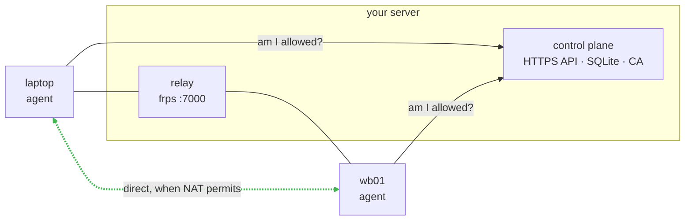
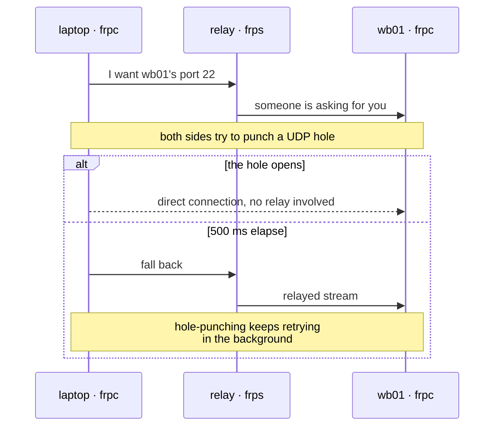
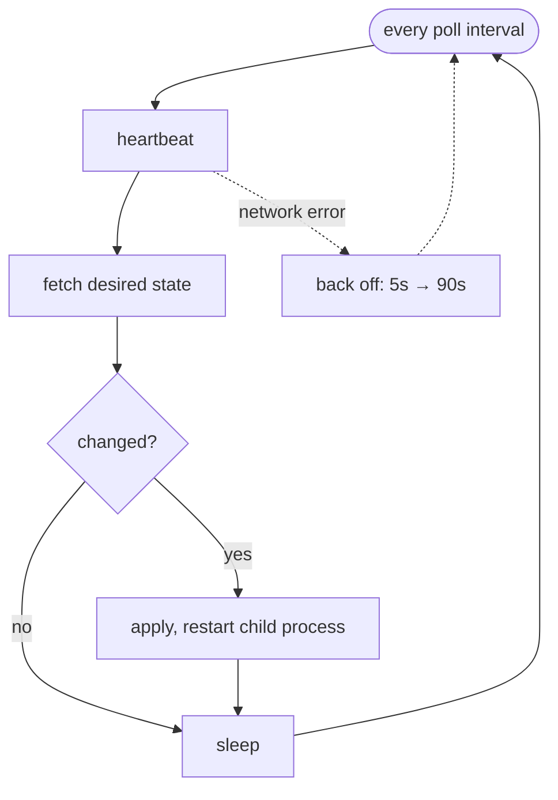
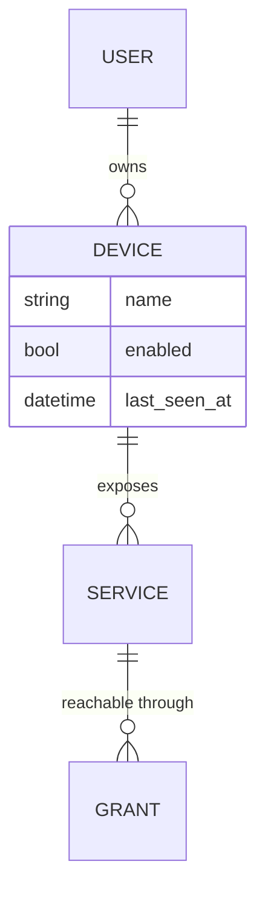

# Diagrams in documentation

Open this once you decide to draw. First, decide whether to.

## When a diagram earns its place

It replaces a paragraph you would otherwise have to read twice:

- **Direction of connections.** Who dials whom, who listens. In prose this turns into "A
  connects to B, and C also connects to B, but B never connects to C".
- **Ordering in time.** A message exchange, a race, a fallback on timeout.
- **A loop.** A daemon, a state machine, retry with backoff.
- **The shape of the data.** What references what, and with what cardinality.

It does not earn its place for:

- Three boxes labelled with layer names and arrows top to bottom. That is a table of
  contents drawn as a picture.
- A directory tree. Use a code block.
- A linear sequence with no branching. Use a numbered list.

Test: cover the text next to the diagram. If the diagram still says something, keep it.

## Topology: flowchart LR

Shows who talks to whom and which way. Edge labels carry what is being sent, in human
words rather than protocol names.



Techniques:

- `<br/>` instead of a second box: name on top, role underneath.
- Dashed `-.->` for the optional path, solid for the main one.
- `subgraph` groups what physically lives together.
- Always quote edge labels as `|"..."|`, or a comma or colon breaks the parser.

## Ordering and races: sequenceDiagram

The best thing available for "try this, and when it fails fall back to that".



Techniques:

- `alt`/`else` for a branch on outcome; `par`/`and` for parallel work.
- `Note over A,B` for what is not a message: local work, waiting, a side effect.
- `-->>` dashed for a reply, `->>` solid for a request.
- Short participant names, with the role via `as`.

## A loop: flowchart TD with a back edge



Technique: the error path goes off to the side, dashed, so it does not compete with the
happy path for attention. A diamond `{"..."}` for the branch.

## Data: erDiagram



Show not every field but the ones that explain behaviour. Label the relation with a verb
(`owns`, `exposes`); quote it when it is more than one word.

## Colours and dark mode

GitHub renders the same SVG in both light and dark themes. Dark colours vanish on dark,
light ones on light.

These work in both:

| Meaning | Colour |
| --- | --- |
| Good / primary path | `#3fb950` |
| Bad / rejected path | `#f85149` |
| Neutral accent | `#58a6ff` |

Do not set node fills by hand: Mermaid's default theme is already adaptive, and a
hardcoded `fill:` breaks in one of the two.

## The trap: linkStyle indices

`linkStyle N` numbers edges **in declaration order, from zero, across the whole
diagram** — including edges inside a `subgraph`. A wrong index is not caught by the
parser: `mermaid.parse()` passes, the render throws, and GitHub shows a red box where
the diagram should be.

Count by hand, top to bottom. Or skip `linkStyle` entirely — dashed versus solid, and
thickness, distinguish paths without colour.

## Validation

A full render in CI rarely pays for itself: `@mermaid-js/mermaid-cli` pulls Chromium.
Two tiers are enough.

**Tier 1, no dependencies** — the skill's script checks block structure, a known diagram
type, and `linkStyle` index bounds:

```sh
uv run plugins/repo-docs/skills/repo-docs/scripts/check_docs.py <repo root>
```

**Tier 2, if node is available** — the real Mermaid parser:

```sh
npm install mermaid jsdom --silent
```

```js
// check.mjs — pull the ```mermaid blocks out and run mermaid.parse() over them
import { JSDOM } from 'jsdom';
const dom = new JSDOM('<!DOCTYPE html><body></body>', { pretendToBeVisual: true });
for (const k of ['window','document','navigator','SVGElement','Element','HTMLElement','Node','getComputedStyle'])
  global[k] = dom.window[k];
const mermaid = (await import('mermaid')).default;
mermaid.initialize({ startOnLoad: false });
await mermaid.parse(src);   // throws on a syntax error
```

`mermaid.render()` will not run under jsdom (no `CSSStyleSheet`), so render-time errors —
the `linkStyle` ones — are caught only by tier 1 or by your eyes on GitHub.

**Tier 3** — open the page on GitHub and look. Mandatory the first time a diagram ships.
